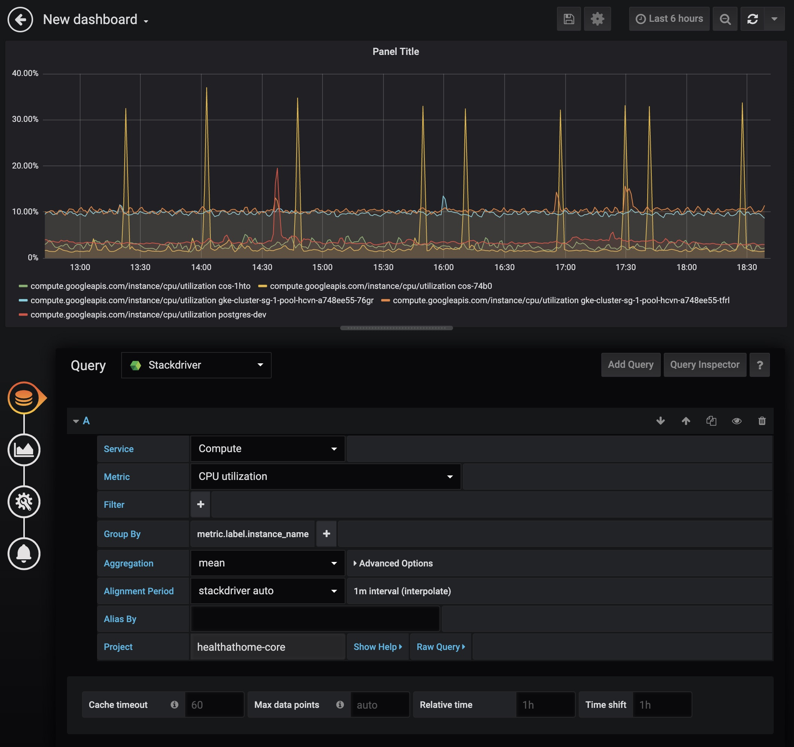

# ดู Stackdriver Monitoring ใน Grafana

ปกติเวลาเราจะดู metric ที่เราเก็บใน Stackdriver เราจะต้องเข้าผ่านเว็บ [app.google.stackdriver.com](https://app.google.stackdriver.com)

แต่ถ้าเราไม่อยากเพิ่ม user ใน Google Cloud Project หรือต้องการรวมกราฟต่าง ๆ ให้มาอยู่ในที่เดียวกัน เราสามารถให้ Grafana ต่อเข้ากับ Stackdriver แล้วดึงกราฟมาแสดงได้

## เพิ่ม Data Sources

1. สร้าง Service Account ใน Google Cloud Project เพื่อให้ Grafana สามารถยิง api ของ project ของเราได้

    ```sh
    $ gcloud iam service-accounts create grafana
    ```

    > grafana คือชิ่อ service account ที่เราจะสร้าง

    > ถ้าไม่ได้ตั้ง default project ใน gcloud cli อย่าลืมใส่ --project=PROJECT_ID ด้วย

1. Grant `roles/monitoring.viewer` ให้กับ service account ที่เราสร้าง

    ```sh
    $ gcloud projects add-iam-policy-binding [PROJECT_ID] \
        --role roles/monitoring.viewer \
        --member=serviceAccount:grafana@[PROJECT_ID].iam.gserviceaccount.com
    ```

1. สร้าง key จาก service account

    ```sh
    $ gcloud iam service-accounts keys create service_account.json \
        --iam-account=grafana@[PROJECT_ID].iam.gserviceaccount.com \
        --key-file-type=json
    ```

    เราจะได้ key น่าตาประมาณนี้ ออกมา

    ```json
    {
        "type": "service_account",
        "project_id": "...",
        "private_key_id": "...",
        "private_key": "...",
        "client_email": "...",
        "client_id": "...",
        "auth_uri": "https://accounts.google.com/o/oauth2/auth",
        "token_uri": "https://oauth2.googleapis.com/token",
        "auth_provider_x509_cert_url": "...",
        "client_x509_cert_url": "..."
    }
    ```

1. เข้าเว็บ grafana ที่เรา deploy ไว้ แล้วไปที่ Data Sources

1. เพิ่ม data source ใหม่ แล้วเลือก Stackdriver

1. Upload key หรือ copy มาใส่ใน textarea ก็ได้ และกดปุ่ม Save & Test

    

## สร้าง Query

เราสามารถสร้าง Query ใหม่ได้แค่เลือก Data source เป็น Stackdriver ที่เราพึ่งสร้าง

แล้วเลือก service, metric ต่าง ๆ ก็จะได้กราฟออกมาเลย




## ไม่มี Grafana

ถ้าใครไม่ได้รัน Grafana สามารถทดลองใช้ที่ [grafana.moonrhythm.io](https://grafana.moonrhythm.io) ได้เลย
เพียงแค่ใช้ Google Sign In
