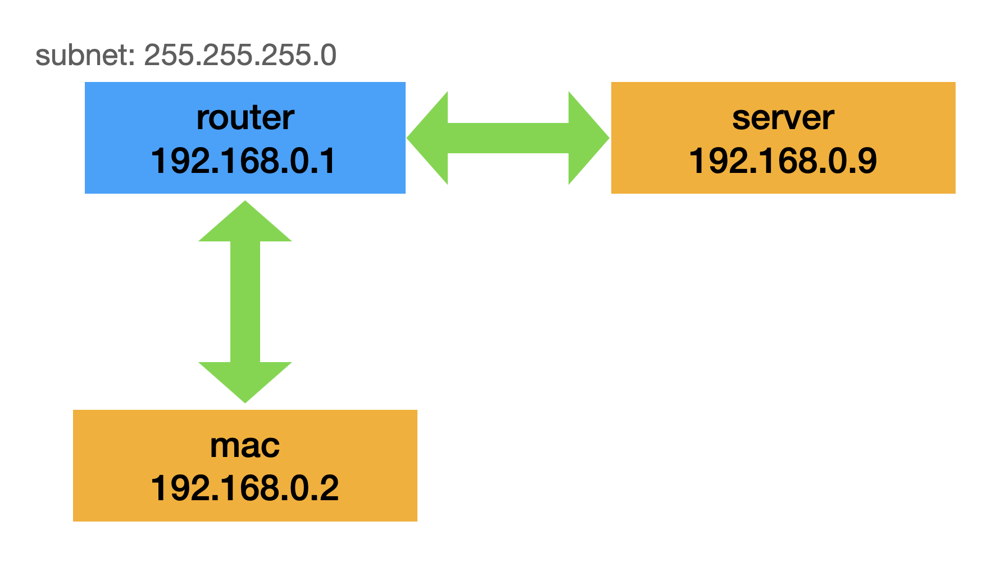
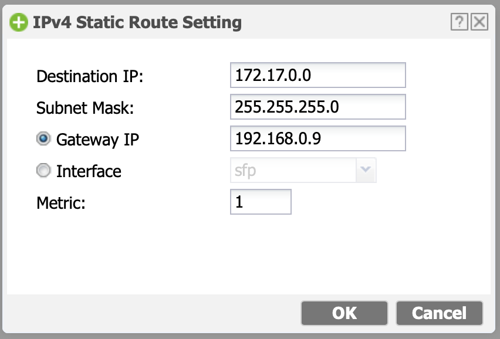
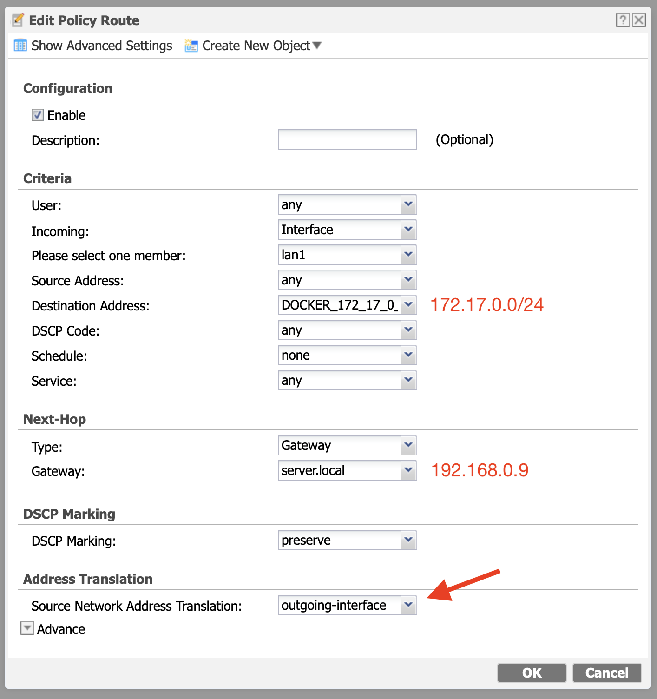
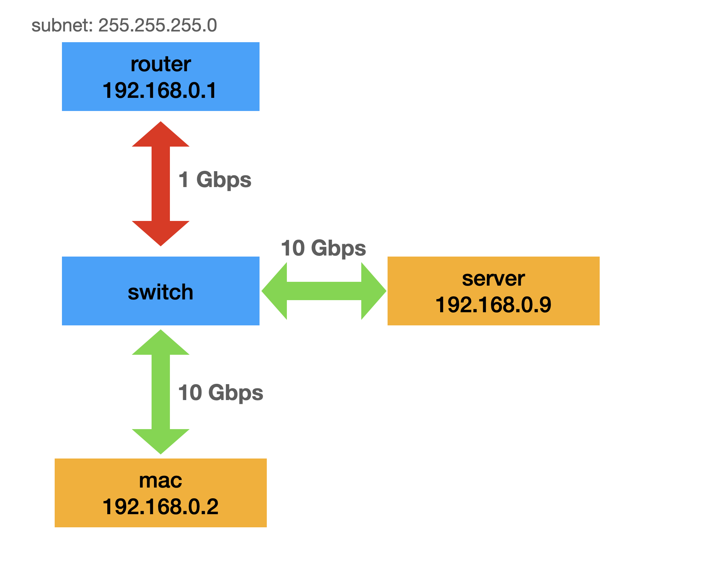
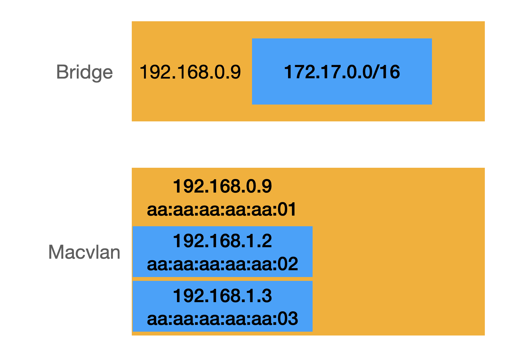
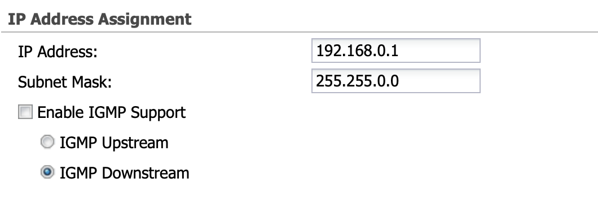
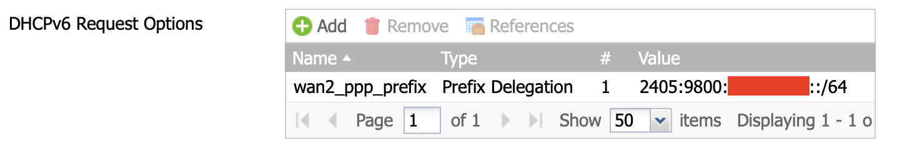
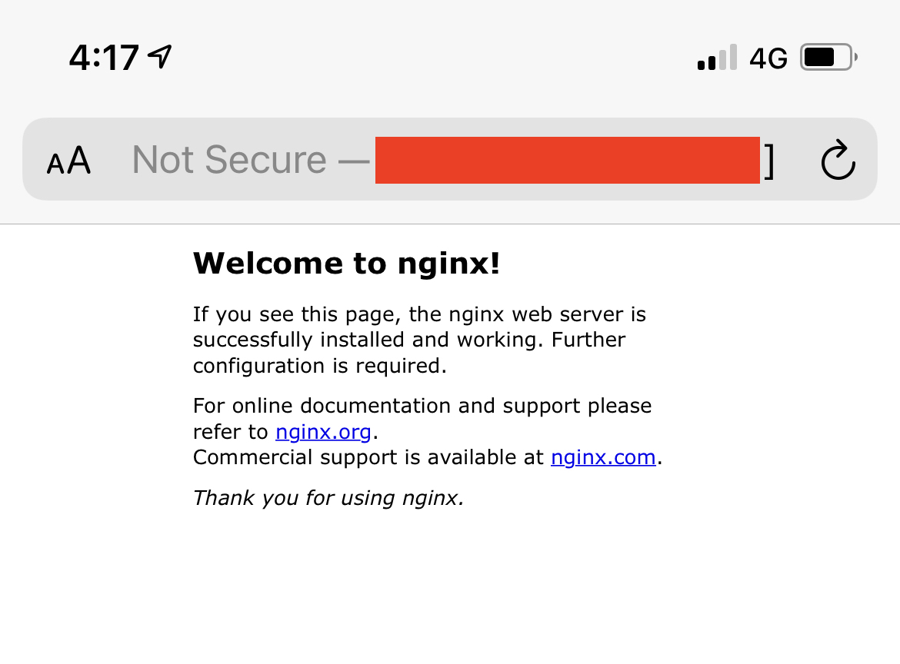

# แจก Public IPv6 ให้กับ Docker Container

> บทความนี้ผมจะมาเล่าสิ่งที่เรียนรู้จากการที่ผมพยายามที่จะ assign public IPv6 ให้กับ docker continer

## ที่มา

ปกติเวลาเรารัน container บน docker เราจะ map port ออกมาจากใน container ด้วยคำสั่ง -p เช่น

```shell
# [server]
$ docker run -p 3000:80 nginx
```

เนื่องจาก default network ของ docker เป็นแบบ bridge, docker เลยทำ NAT จาก host เข้ามาที่ container

```shell
# [server]
$ sudo iptables -t nat -L DOCKER | grep 3000
DNAT tcp  --  anywhere anywhere tcp dpt:3000 to:172.17.0.3:80
```

ถ้าดูดี ๆ จะเห็นว่า container ก็ ip เป็น `172.17.0.3`

ถ้าลองยิงจาก host ผ่าน ip นี้ ก็น่าจะเข้าได้ ?

```shell
# [server]
$ curl http://172.17.0.3 -I
HTTP/1.1 200 OK
Server: nginx/1.19.10
Date: Fri, 23 Apr 2021 04:50:05 GMT
Content-Type: text/html
Content-Length: 612
Last-Modified: Tue, 13 Apr 2021 15:13:59 GMT
Connection: keep-alive
ETag: "6075b537-264"
Accept-Ranges: bytes
```

แต่ถ้าเรายิงจากเครื่องอื่นที่อยู่ในวง LAN เดียวกัน ก็น่าจะยิงไม่ได้ เพราะไม่รู้จัก IP นี้

```shell
# [mac]
$ curl http://172.17.0.3 -I
curl: (28) Failed to connect to 172.17.0.3 port 80: Operation timed out
```

## ก่อนอื่นลองมาดูเครื่องที่ผมใช้เทสกันก่อน

เพื่อให้เราเข้าใจตรงกัน ผมจะวาด network topology ที่ผมใช้เทสในบทความนี้ให้ดูก่อน



จากรูปจะเห็นว่าเป็น network ทั่วไปที่ใช้กันตามบ้านเลย

## ลองให้ mac connect ไปหา Container ให้ได้ก่อน

ตอนนี้เครื่อง mac ของเราไม่รู้จัก IP `172.17.0.3` เลยไม่สามารถ connect เข้าไปได้

ลองทำให้ mac รู้จัก IP นี้ก่อน ด้วยคำสั่ง


```shell
# [mac]
$ sudo route add 172.17.0.0/24 192.168.0.9
add net 172.17.0.0: gateway 192.168.0.9
```

ลองยิงใหม่ดู

```shell
# [mac]
$ curl http://172.17.0.3 -I
HTTP/1.1 200 OK
Server: nginx/1.19.10
Date: Fri, 23 Apr 2021 05:04:48 GMT
Content-Type: text/html
Content-Length: 612
Last-Modified: Tue, 13 Apr 2021 15:13:59 GMT
Connection: keep-alive
ETag: "6075b537-264"
Accept-Ranges: bytes
```

ตอนนี้ mac เราสามารถยิงเข้าไปที่ Container ได้แล้ว

ถ้าดู log ที่ nginx

```
192.168.0.2 - - [23/Apr/2021:05:04:48 +0000] "HEAD / HTTP/1.1" 200 0 "-" "curl/7.76.1" "-"
```

nginx เห็น IP ของเครื่อง mac `192.168.0.2` ด้วย

## จะทำยังไงให้สามารถเข้าได้โดยที่ไม่ต้อง add route ?

การที่เราจะมา add route ให้กับคอมทุกเครื่องก็คงลำบากแน่ ๆ อย่างมือถือจะทำยังไง ?

เลยต้องหาวิธีที่ทำให้สามารถใช้งานได้โดยที่ไม่ต้อง add route

ก่อนอื่นเราลบ route ที่ add ไปออกก่อน

```shell
# [mac]
$ sudo route delete 172.17.0.0/24
delete net 172.17.0.0
```

ลอง ping ดูว่าเข้าไม่ได้แล้ว

```shell
# [mac]
$ ping 172.17.0.3 -c 3
PING 172.17.0.3 (172.17.0.3): 56 data bytes
Request timeout for icmp_seq 0
Request timeout for icmp_seq 1

--- 172.17.0.3 ping statistics ---
3 packets transmitted, 0 packets received, 100.0% packet loss
```

ถ้าเราไปเพิ่ม static route ที่ router จะได้ไหมนะ ?



```shell
# [mac]
$ ping 172.17.0.3 -c 3
PING 172.17.0.3 (172.17.0.3): 56 data bytes
64 bytes from 172.17.0.3: icmp_seq=0 ttl=63 time=0.514 ms
92 bytes from 192.168.0.1: Redirect Host(New addr: 192.168.0.9)
Vr HL TOS  Len   ID Flg  off TTL Pro  cks      Src      Dst
 4  5  00 0054 4c0a   0 0000  3f  01 c2e0 192.168.0.2  172.17.0.3

64 bytes from 172.17.0.3: icmp_seq=1 ttl=63 time=0.447 ms
64 bytes from 172.17.0.3: icmp_seq=2 ttl=63 time=0.340 ms

--- 172.17.0.3 ping statistics ---
3 packets transmitted, 3 packets received, 0.0% packet loss
round-trip min/avg/max/stddev = 0.340/0.434/0.514/0.072 ms
```

ping ได้แฮะ ลอง curl ดูสิ๊

```shell
# [mac]
$ curl http://172.17.0.3 -I
curl: (56) Recv failure: Operation timed out
```

อ่าว ทำไม curl ไม่ได้หล่ะเนี่ย งงจัด

งั้นลองทำ SNAT ที่ router ดูก่อน



```shell
# [mac]
$ curl http://172.17.0.3 -I
HTTP/1.1 200 OK
Server: nginx/1.19.10
Date: Fri, 23 Apr 2021 05:30:09 GMT
Content-Type: text/html
Content-Length: 612
Last-Modified: Tue, 13 Apr 2021 15:13:59 GMT
Connection: keep-alive
ETag: "6075b537-264"
Accept-Ranges: bytes
```

เข้าได้แล้ว

แต่!!!

ถ้าเราเข้าไปดู log ที่ nginx

```
192.168.0.1 - - [23/Apr/2021:05:30:09 +0000] "HEAD / HTTP/1.1" 200 0 "-" "curl/7.76.1" "-"
```

จะเห็นว่า nginx เห็น IP ของ router `192.168.0.1` แทนที่จะเป็น IP ของ mac `192.168.0.2`

ปัญหานี้เกิดจากเราคุยกับ router แล้ว router คุยกับ nginx, เราไม่ได้คุยกับ nginx ตรง ๆ

ลอง traceroute ดู

```shell
# [mac]
$ traceroute 172.17.0.3
traceroute to 172.17.0.3 (172.17.0.3), 64 hops max, 52 byte packets
 1  192.168.0.1 (192.168.0.1)  0.501 ms  0.256 ms  0.176 ms
 2  192.168.0.9 (192.168.0.9)  0.391 ms  0.438 ms  0.372 ms
 3  172.17.0.3 (172.17.0.3)  0.378 ms  0.495 ms  0.417 ms
```

ปัญหาคืออะไร ???

ขอวาด Network Topology ใหม่ ที่ให้ดูข้างบนไม่ใช่ของจริง 🙈



จะเห็นว่ามันส่ง packet อ้อมไป router แล้วค่อยอ้อมกลับมาหา server แทนที่จะวิ่งผ่าน switch 10 Gbps

## แล้วมีวิธีไหนที่ทำให้ Router มองเห็น Container ตรง ๆ ได้บ้าง ?

ก่อนอื่นลองมาดู network ของ docker ก่อนว่ามี driver อะไรบ้าง [https://docs.docker.com/network/](https://docs.docker.com/network/)

ถ้าเราอ่านตรงหัวข้อ [Network driver summary](https://docs.docker.com/network/#network-driver-summary) จะเห็นว่า Macvlan จะตรงกับสิ่งที่เราต้องการมากที่สุด ก็คือ Container จะเป็นเหมือนเครื่องจริง ๆ บน network ที่มี MAC address ของมันเอง

หน้าตาของ Bridge กับ Macvlan เลยจะเป็นแบบนี้



## ลองสร้าง Macvlan บน Docker

ก่อนอิื่นเราต้องทำให้ Router มองเห็น subnet ที่เราจะรัน Container ก่อน

ตอนนี้ Router ของเราเป็น 192.168.0.0/24

แต่เราจะให้ 192.168.1.0/24 กับ Docker

เราจะต้องขยาย subnet บน Router ให้รองรับ 192.168.1.0/24 ด้วย
แต่ไหน ๆ ก็จะขยายแล้ว ก็ขยายไปเป็น 192.168.0.0/16 (255.255.0.0) เลยละกัน 🤷‍♂️



ลองสร้าง network บน docker เป็น macvlan ดู

```shell
# [server]
$ docker network create -d macvlan -o parent=enp2s0 \
    --subnet=192.168.0.0/16 \
    --gateway=192.168.0.1 \
    --ip-range=192.168.1.0/24 \
    docker_net
```

คราวนี้ลองรัน nginx บน macvlan ที่พึ่งสร้าง

```shell
# [server]
$ docker run --net=docker_net --ip=192.168.1.2 nginx
```

ลอง curl เข้าไปดูว่าต่อได้ไหม

```shell
# [mac]
$ curl 192.168.1.2 -I
HTTP/1.1 200 OK
Server: nginx/1.19.10
Date: Fri, 23 Apr 2021 08:34:43 GMT
Content-Type: text/html
Content-Length: 612
Last-Modified: Tue, 13 Apr 2021 15:13:59 GMT
Connection: keep-alive
ETag: "6075b537-264"
Accept-Ranges: bytes
```

แล้วดู log ฝั่ง nginx ดูว่าเห็น IP ของ mac รึเปล่า ?

```
192.168.0.2 - - [23/Apr/2021:08:34:43 +0000] "HEAD / HTTP/1.1" 200 0 "-" "curl/7.76.1" "-"
```

ตอนนี้เราก็สามารถรัน Container ให้อยู่ในวง LAN เดียวกันได้แล้ว

แต่!!!

## Host ไม่สามารถ Connect เข้า Container ได้

ถ้าเราลอง curl ผ่าน server จะเห็นว่าเราไม่สามารถ connect เข้าไปใน container ได้

```shell
# [server]
$ curl 192.168.1.2 -I
curl: (7) Failed to connect to 192.168.1.2 port 80: No route to host
```

เราจะต้องสร้าง interface ใหม่ เพื่อ bridge ระหว่าง host กับ container

```shell
# [server]

# สร้าง interface ใหม่ ชื่อ docker_net
$ sudo ip link add docker_net link enp2s0 type macvlan mode bridge

# ให้ host ip เป็น 192.168.1.254 ตอนนี้จะ connect เข้าไปใน network ของ docker_net
$ sudo ip addr add 192.168.1.254/32 dev docker_net

# เปิดใช้ interface docker_net
$ ip link set docker_net up

# เพิ่ม route 192.168.1.0/24 เข้าไปใน docker_net
$ ip route add 192.168.1.0/24 dev docker_net
```

คราวนี้ลอง curl ใหม่อีกรอบ

```shell
# [server]
$ curl http://192.168.1.2 -I
HTTP/1.1 200 OK
Server: nginx/1.19.10
Date: Fri, 23 Apr 2021 08:45:26 GMT
Content-Type: text/html
Content-Length: 612
Last-Modified: Tue, 13 Apr 2021 15:13:59 GMT
Connection: keep-alive
ETag: "6075b537-264"
Accept-Ranges: bytes
```

ถ้าดู log ใน nginx จะเห็น IP ของ server เป็น `192.168.1.254`

## ทำให้ Interface ไม่หายเมื่อ reboot เครื่อง

คำสั่ง `ip` ที่เรารันไปจะหายไปเมื่อเรา reboot เครื่อง

จะทำยังไงให้พอ reboot แล้ว ใช้งานได้เหมือนเดิม ?

> เนื่องจากเครื่อง server ของผมใช้ **systemd-networkd** เป็นตัวจัดการ network
เลยจะขอพูดถึงวิธีการ config ที่ผมใช้เท่านั้น

ตัว systemd-networkd จะใช้วิธีการ config ผ่าน directory `/etc/systemd/network`

ถ้าเข้ามาดูจะเห็นว่าปัจจุบันผมได้ config ให้ให้มัน get IP จาก DHCP ของ Router อยู่

```shell
# [server]
$ cd /etc/systemd/network
$ cat 20-wired.network
[Match]
Name=enp2s0

[Network]
DHCP=yes
```

เราก็จะสร้าง netdev ของ Macvlan ขึ้นมาก่อน

```shell
# [server]
$ cat <<EOF > 22-docker_net.netdev
[NetDev]
Name=docker_net
Kind=macvlan

[MACVLAN]
Mode=bridge
EOF
```

หลังจากนั้นเราก็ config netdev ที่สร้าง

```shell
# [server]
$ cat <<EOF > 22-docker_net.network
[Match]
Name=docker_net

[Network]
Address=192.168.1.254/32

[Route]
Destination=192.168.1.0/24
EOF
```

แล้วก็ restart systemd-networkd

```shell
$ sudo systemctl restart systemd-networkd
```

## Setup Macvlan ให้ support IPv6

หลังจากที่เรา setup ให้ Container ของเราอยู่ในวง LAN ได้แล้ว คราวนี้เราจะทำให้ Macvlan ของเรา support IPv6

ก่อนอื่นเราก็ปิด nginx แล้วลบ network เก่าทิ้งก่อน

```shell
# [server]
$ docker network rm docker_net
```

คราวนี้เราไปดูว่า ISP ของเราแจก IPv6 prefix อะไรมาให้



เราก็สร้าง docker network ด้วย prefix อันนี้

โดยที่เราจะแจก /96 ให้ Container

```shell
# [server]
$ docker network create -d macvlan -o parent=enp2s0 \
    --subnet=192.168.0.0/16 \
    --gateway=192.168.0.1 \
    --ip-range=192.168.1.0/24 \
    --ipv6 \
    --subnet=2405:9800:xxxx:xxxx::/64 \
    --ip-range=2405:9800:xxxx:xxxx::/96 \
    docker_net
```

คราวนี้เวลาที่เรารัน container ก็แค่ใส่ IP เข้าไป

```shell
# [server]
$ docker run \
    --net=docker_net \
    --ip=192.168.1.2 \
    --ip6=2405:9800:xxx:xxx::2 nginx
```

ลอง curl ดู

```shell
$ curl http://[2405:9800:xxxx:xxxx::2] -I
HTTP/1.1 200 OK
Server: nginx/1.19.10
Date: Fri, 23 Apr 2021 09:15:07 GMT
Content-Type: text/html
Content-Length: 612
Last-Modified: Tue, 13 Apr 2021 15:13:59 GMT
Connection: keep-alive
ETag: "6075b537-264"
Accept-Ranges: bytes
```

หรือจะลองเอาเน็ตมือถือเข้ามาก็ได้



ในที่สุดก็แจก Public IPv6 เข้า Container ได้แล้ว เย่!

## ปัญหาเรื่อง Prefix IPv6

เท่าที่ลองใช้มาตอนนี้ของ AIS Fibre ยังไม่เจอ prefix เปลี่ยน
แต่เคยโทรไปถามแล้ว call center บอกว่าไม่ได้ fixed ไว้ อาจจะเปลี่ยนได้

ส่วนของ 3bb แค่เน็ตหลุด prefix ก็เปลี่ยนแล้ว 😂
เคยโทรไปขอ fixed prefix แล้ว แต่ยังไม่มีบริการนี้

ดังนั้นใครจะใช้ IPv6 ลองโทรไปขอกันเยอะ ๆ นะ เผื่อเขาจะทำให้ แล้วมาบอกผมด้วย 😅
