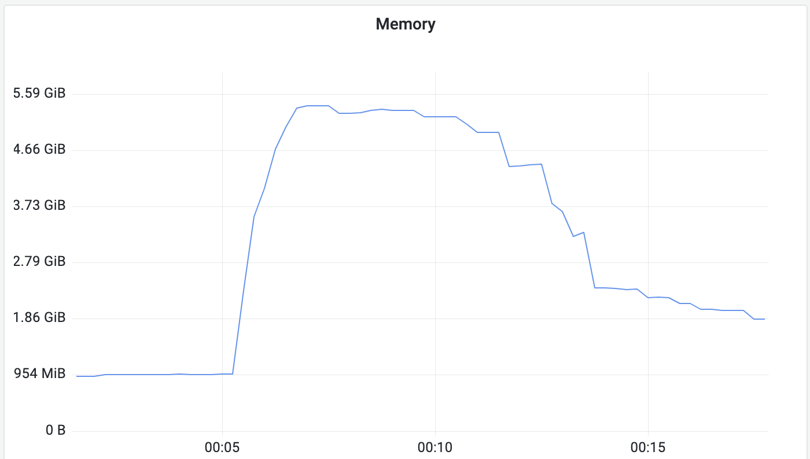

# Concurrent Queue Ratelimit

> บทความนี้จะเล่าเกี่ยวกับปัญหาที่เจอ และการใช้ concurrent queue rate limit มาแก้ปัญหา

## ถ้าพูดถึง Rate limit

สิ่งแรกที่จะนึกถึงก็คือ ถ้ามี request จาก IP เดียวกันเข้ามาเกิน 10 requests ต่อวินาทีให้ block IP นั้นเป็นระยะเวลา 10 วินาที

> แต่ถ้ามี requests เข้ามาจากหลาย IP หล่ะ เราจะ block ที่ไหน ?

หลักการของ reverse proxy นั้นไม่มีอะไรซับซ้อน แค่รับ request เข้ามาแล้วส่งต่อไปให้ upstream ดังนั้น reverse proxy จะรองรับ load ได้เยอะอยู่แล้ว

## ปัญหาคืออะไรหล่ะ ?


ถ้าดูจากรูปข้างบนก็ไม่น่าจะมีปัญหาอะไรนิ ?

แต่ถ้า upstream เรารับ load ได้แค่ 250 req/s หล่ะ ?


แล้วอีก 500 req/s ไปที่ไหน ?

แน่นอนว่ามันก็ถูกยิงไปที่ upstream แต่ upstream ไม่สามารถตอบกลับมาได้นั่นเอง ทำให้มี active connections เพิ่มขึ้นสะสมในระบบ


สิ่งที่เกิดขึ้นคือ reverse proxy ต้อง hold requests เหล่านั้นไว้ ทำให้ memory ของ reverse proxy เพิ่มขึ้นเรื่อย ๆ จนเต็ม เพราะไม่สามารถระบาย requests ออกทัน



แน่นอนว่าเราไม่สามารถใช้ rate limit เพื่อ limit req/s จาก client ip ได้ เพราะว่าถ้ามี ip เข้ามา 100,000 ip แต่ส่งมาแค่ ip ละ 2 req/s ก็เท่ากับ 200,000 req/s ที่ไม่สามารถ trigger rate limit ได้

## แต่สิ่งที่เราจะ focus

เราจะไม่สนว่า upstream จะรับ load ได้ไหม แต่จะทำยังไงให้ **reverse proxy** รับ load ได้

### ถ้า request เข้ามาที่ host นี้เยอะ

เราก็​เอาชื่อ **host** มาใช้เป็น key ที่ใช้ rate limit แทน client ip สิ ?

```go
m.Use(&ratelimit.RateLimiter{
	Strategy: &ratelimit.FixedWindowStrategy{
		Max:  500,
		Size: time.Second,
	},
	Key: func(r *http.Request) string {
		return r.Host
	},
})
```

### แล้วเราควรจะ limit เท่าไร ?

แต่นอนว่า upstream แต่ละตัวรับ load ได้ต่างกัน เพราะฉะนั้นเราไม่มีทางหาจำนวน req/s ได้แน่ ๆ

แทนที่เราจะบอกว่าใน 1 วินาที จะส่ง request ไป 500 requests ลองเปลี่ยนเป็น จะส่ง request ไปให้ **พร้อมกัน** ไม่เกิน 500 requests แต่ถ้ามี request เข้ามาเกินว่าที่จะส่งได้ reverse proxy จะ hold requests ให้ ไม่เกิน 5,000 requests


```go
m.Use(&ratelimit.RateLimiter{
	Strategy: &ratelimit.ConcurrentQueueStrategy{
		Capacity: 500,  // maximum concurrent requests
		Size:     5000, // maximum requests in queue
	},
	Key: func(r *http.Request) string {
		return r.Host
	},
})
```

[source code](https://github.com/moonrhythm/parapet/blob/ad71925574ea213e07b9d28ce4d7f12952d839eb/pkg/ratelimit/concurrentqueue.go)

ซึ่งขอเรียกวิธีนี้ว่า **Concurrent Queue Ratelimit** (ไม่แน่ใจคนอื่นเรียกว่าอะไร 🤪)

วิธีนี้ทำให้ upstream ที่ทำงานเร็ว ก็รับ request ได้เยอะ ส่วน upstream ที่รับ load ได้ไม่เยอะ ก็ไม่ overload มากจนเกินไป

แล้วมันคือกี่ req/s หล่ะ ?

- ถ้า 1 request ใช้เวลา 1ms แสดงว่าจะ process request ได้ 500,000 req/s
- แต่ถ้า 1 request ใช้เวลา 100ms ก็จะ process request ได้ 5,000 req/s

## สรุป

- วิธีนี้ช่วยไม่ให้ reverse proxy hold request เยอะเกินไป
- ช่วยให้ upstream server ไม่ต้องรับ load ที่ไม่สามารถ handle ได้
- ถ้ามี request เข้ามาเยอะเกิน คนที่เข้ามาทีหลัง แม้ว่าจะไม่ได้ส่ง request มาเยอะ แต่ก็ได้ error 503
