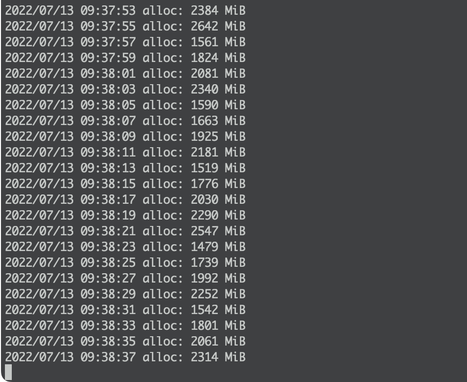
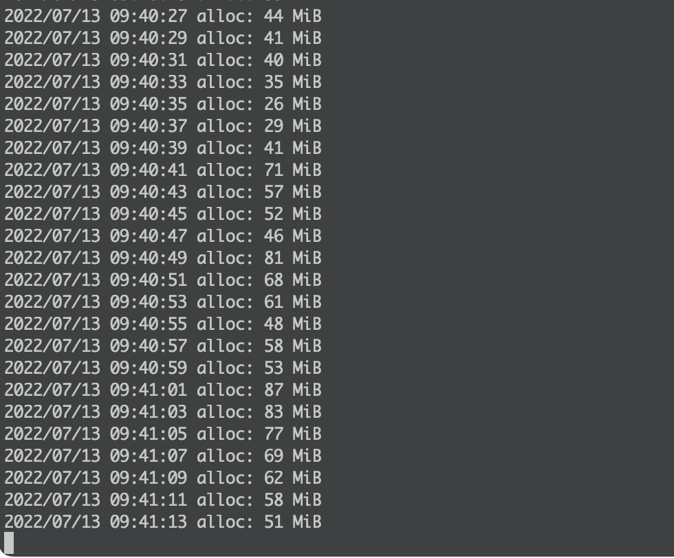

# Max HTTP Header Size

> ใครที่เอา code server ขึ้นโดยที่ไม่ได้เอา reverse proxy มาคั่น ต้องระวังเรื่อง Max HTTP Request Header Size

## HTTP Header คืออะไร

HTTP header คือ metadata ที่เราส่งไปด้วยกับ request หรือ response

เช่น

```
GET / HTTP/1.1
Host: example.com
Accept: */*

```

header ก็คือ `Host` และ `Accept`

## ปัญหา

ถ้าเราสร้าง HTTP server แล้วไม่ได้กำหนด Max size ค่า default อาจจะเยอะมาก ๆ เช่น

```go
package main

import (
	"log"
	"net/http"
	"runtime"
	"time"
)

func main() {
	s := http.Server{}
	s.Addr = ":8080"
	s.Handler = http.HandlerFunc(func(w http.ResponseWriter, r *http.Request) {
		w.Write([]byte("ok"))
	})
	go func() {
		for {
			var m runtime.MemStats
			runtime.ReadMemStats(&m)
			log.Printf("alloc: %d MiB", m.Alloc/1024/1024)
			time.Sleep(2 * time.Second)
		}
	}()
	log.Fatal(s.ListenAndServe())
}

```

ดูเหมือนไม่มีอะไร แต่ถ้าเราลองยิง request ที่ header ใหญ่ ๆ เข้าไปหล่ะ



จะเห็นว่าตัว server ของเราจะใช้ memory เยอะมาก ๆ

ซึ่งผมเคยโดน DoS (Denial of Service) Attack มารอบนึง คนที่โจมตีไม่ได้ส่ง request/s มาเยอะเลย แต่ส่ง header มาใหญ่มาก ๆ ซึ่งค่า default ของ Go ก็คือ 1 MiB

แสดงว่าคนโจมตีแค่ส่งมาแค่ 1,000 request แต่ส่ง header มา request ละ 1 MiB เราก็ต้องใช้ memory 1 GiB มารับ requests เหล่านั้น ทำให้เครื่อง server ram หมด

## วิธีแก้

ง่ายมาก เราก็แค่ใส่ max header size ไปตอนที่สร้าง server เช่น

```golang
// ...
func main() {
	s := http.Server{
		MaxHeaderBytes: 1 << 14, // 16 KiB
	}
    // ...
```

ทำให้คนที่จะโจมตี server เรา สามารถส่ง header มาได้แค่ 16 KiB เราก็จะสามารถรับ request ได้เยอะขึ้น โดยใช้ memory น้อยลง



## สรุป

Server ที่รับ request ตรงจาก user อย่าลืมตั้ง Max Header Size ไม่ว่าจะเป็น reverse proxy หรือว่าจะเป็น code ของเราเองก็ตาม
