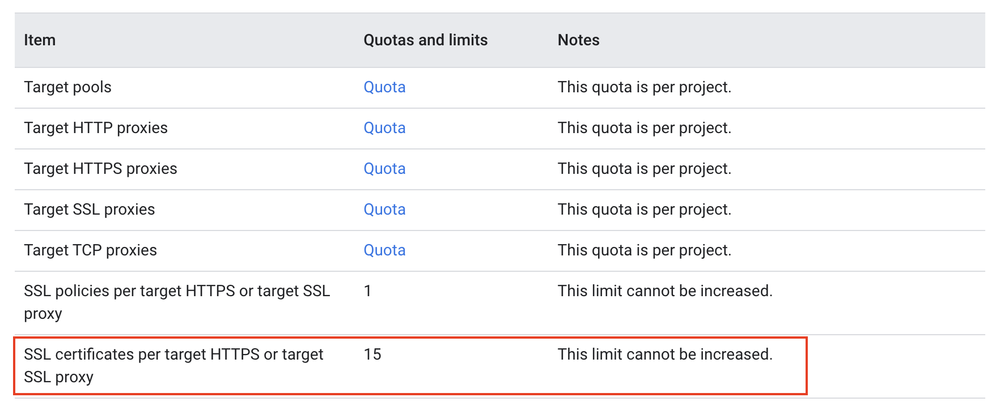
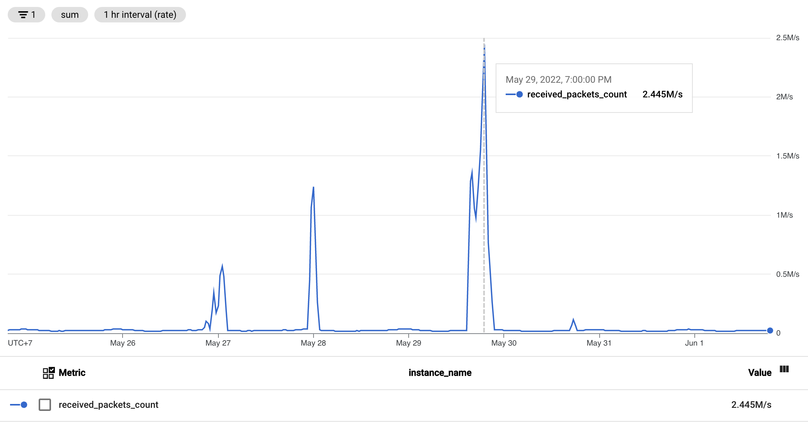
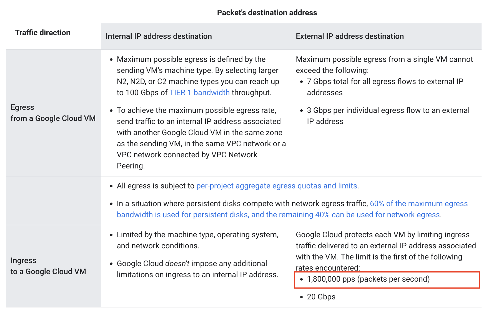

# อย่าเปิด Reverse Proxy เองถ้าไม่มีระบบป้องกัน DDoS

> บทความนี้มาเล่าว่าทำไมเราถึงไม่ควรเปิด reverse proxy ให้ทุกคนเข้ามาจาก Internet ได้

## เล่าที่มา

เนื่องจากระบบของผมต้องรองรับ HTTPS จากหลาย ๆ domains ทำให้ไม่สามารถใช้ L7 Load Balancer ได้ เพราะโดนข้อจำกัดตรงที่จำนวน Ceritificate ที่สามารถเพิ่มได้อย่างจำกัด

เลยมีความจำเป็นที่จะต้องใช้ Network Load Balancer แล้วส่งตรงเข้า Instance Group ของ Ingress ทำให้เวลามีคนเข้าเว็บ คน ๆ นั้นจะต้อง connect TCP ตรงกับ VM ของเรา

## ปัญหา

พอ VM เรารับ TCP ตรง ๆ จาก user ก็อาจจะมีคนไม่หวังดีส่งจำนวน network packet มาเยอะมาก ๆ จน OS ไม่สามารถ process ได้ทัน ทำให้ reverse proxy เราล่มได้

ถึงแม้เราจะ scale up vCPU ไปเยอะมาก ๆ แต่ก็โดน limit จาก Cloud Provider อยู่ดี

## วิธีแก้ปัญหา

จริง ๆ วิธีแก้ปัญหามีหลายวิธี เช่น

1. ก็ย้ายไปใช้ Cloud ที่มีระบบป้องกัน L4 DDoS สิ

    มี Cloud หลายเจ้าที่มีระบบป้องกัน L4 DDoS เราสามารถย้ายทั้งระบบไป หรือจะย้ายแค่ reverse proxy ไปก็ได้ เราก็จะมีระบบป้องกัน DDoS ที่เป็น Network layer

1. ใช้ DDoS Protection Provider

    เช่น Cloudflare แน่นอนว่ามีค่าใช้จ่ายค่อนข้างสูง(มาก)

ซึ่ง ณ ตอนที่ตัดสินใจ ตอนนั้นมีลูกค้ารายใหญ่(?) ที่ช่วยค่า infra อยู่ จึงตัดสินใจไปทาง Cloudflare แต่ตอนนี้ลูกค้ารายใหญ่(?) ก็ใกล้จะไปไม่รอดแล้ว 😱 เลยเริ่มคิดหนักละ 😢 (ตอนนี้ก็กำลังหาลูกค้ามาช่วยค่า infra อยู่นะ 🥹🙏🙇)

## สรุป

เราไม่ควรรัน reverse proxy แล้วเปิด port ให้เข้ามาจาก Internet ถ้า Cloud ที่ใช้ไม่มี service DDoS protection มาให้
